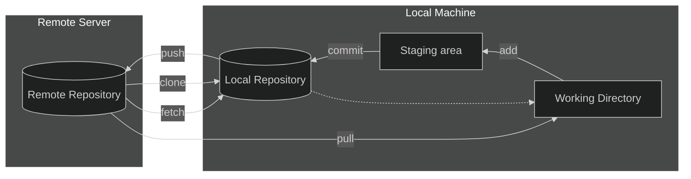
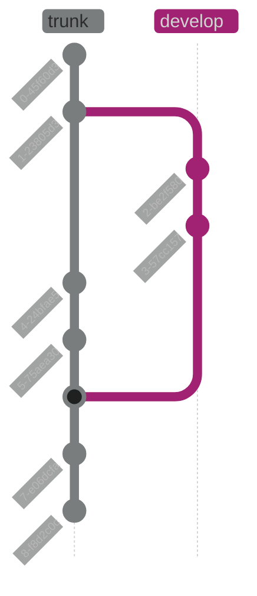

# Source Control

Git is a distributed VCS (Version Control System), also referred to as a SCM (Source Code Management) tool. It is designed for tracking changes in source code and other text-based files.

## High-level concepts

<!-- tabs:start -->

### **Working Directory**

The Working Directory, or work tree, is the directory on your local machine where you carry out your work.

It contains the project files and directories, along with git configuration files. When you modify files in your working dir, Git tracks those changes, which you can later add to the staging area, and then commit to the repository.

> [!TIP|label:Common Actions]
> - View a list of changed files -> `git status`
> - See the difference between the original file and working copy -> `git diff <filename>`
> - Remove a file from the working directory and stage the removal -> `git rm <filename>`

### **Staging Area**

The Staging Area, or index, is an intermediate area where Git collects changes before they are committed to the local repository. When you make changes in your Working Directory and decide you want to include them in your next commit, you add these changes to the Staging Area using `git add`.

The Staging Area allows you to group changes before creating a commit. This can be useful for organizing your commits and making sure they only include relevant changes.

> [!TIP|label:Common Actions]
> - View changes in the staging area -> `git status`
> - Add specific file to the staging area -> `git add <filename>`
> - Add *all* changes from PWD downwards -> `git add .`
> - Remove a file from the working directory and stage the removal -> `git rm <filename>`

### **Local Repo**

The Local Repository is the .git directory inside your project's root directory. It contains all the project history, including all committed changes. When you commit changes from the Staging Area, they are saved in the Local Repository.

The Local Repository allows you to work independently of the Remote Repository, enabling you to commit changes, review history, and manage branches on your local machine.

> [!TIP|label:Common Actions]
> - Commit changes to the local repo -> `git commit -m "Your commit message"`
> - View commit history -> `git log`

### **Remote Repo**

The Remote Repository is a version of your project that is hosted on a remote server, such as GitHub, GitLab, or Bitbucket. It allows multiple collaborators to share their work and keep their changes synchronized.

You can push your local commits to the Remote Repository and pull changes from it to keep your Local Repository up-to-date. This setup facilitates collaboration and backup of your project.

> [!TIP|label:Common Actions]
> - Push changes to the remote repo -> `git push`
> - Pull changes from the remote repo -> `git pull`
> - Fetch changes from the remote repo -> `git fetch`

> [!NOTE]
> **Difference between `git fetch` and `git pull`**:
> - `git fetch` downloads the latest changes from the remote repository but does not merge them into your local branch. It updates your remote tracking branches, allowing you to review changes before integrating them.
> - `git pull` is a combination of `git fetch` and `git merge`. It downloads the latest changes from the remote repository and immediately attempts to merge them into your current branch.

<!-- tabs:end -->

---

## Branching

## Sub Title

Wow, such a nice sub-title

## H2

More

### H3

Content

#### H4

Heyo, i'm not in sidebar due to depth setting in `index.html`
